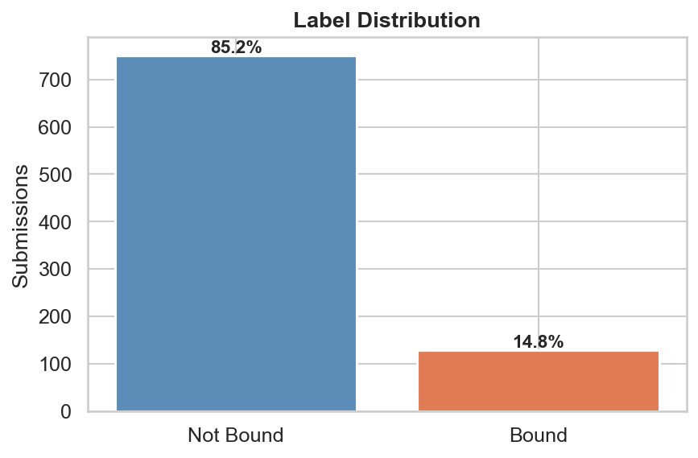
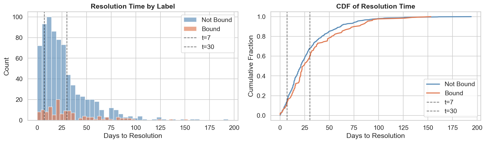
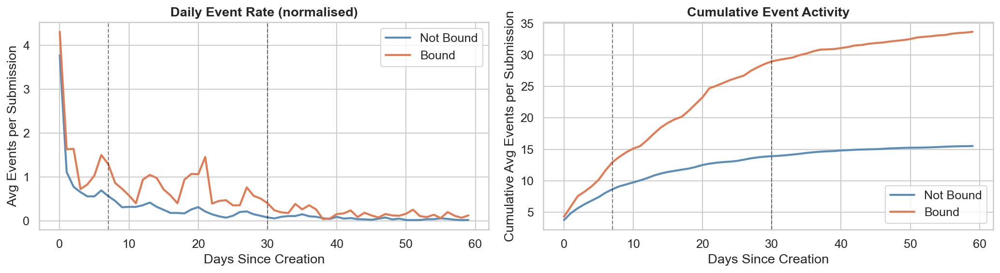
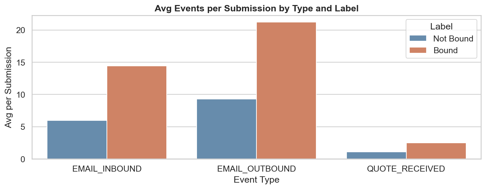
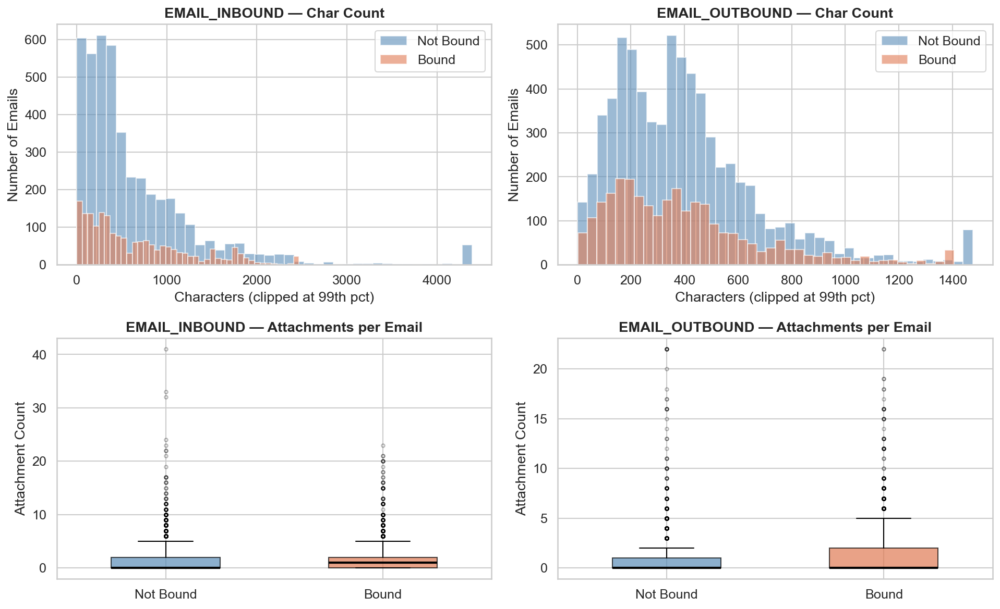
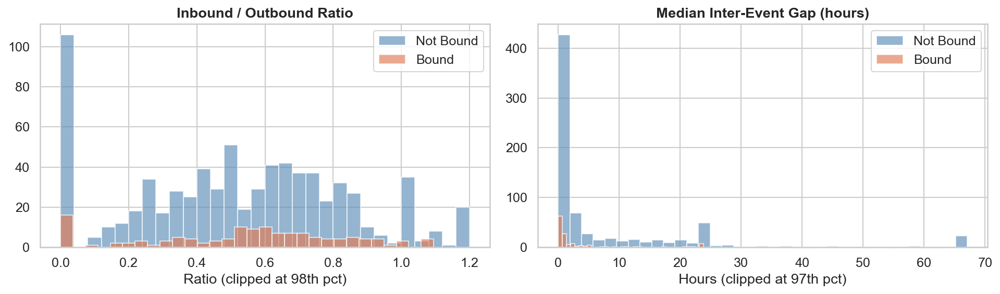
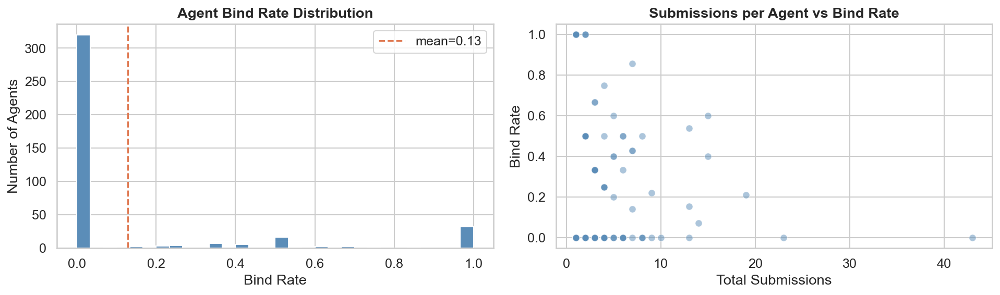
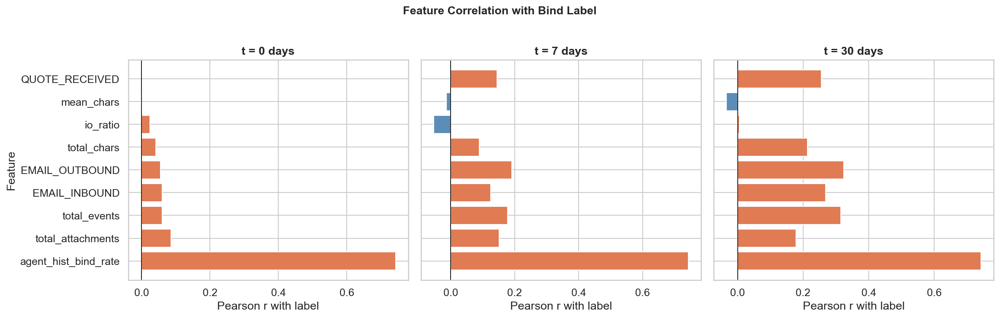

# Task 1: Exploratory Data Analysis

Full notebook: [EDA.ipynb](EDA.ipynb)

---

## Class Distribution

The dataset is heavily imbalanced — only ~13% of submissions bind.

## Resolution Time

Bound and not-bound submissions resolve in similar timeframes, so resolution speed alone is not a useful signal. The `t=7` and `t=30` windows cover the bulk of the lifecycle.

## Data Leakage Audit

All events precede the submission's `resolvedDate` — no post-resolution events exist in the data, so there is no temporal leakage risk.

## Event Activity Over Time

Bound submissions generate significantly more event activity per day than not-bound ones, and this divergence is visible from the first week. **Early prediction is feasible.**

## Event Type Mix

Bound submissions accumulate more events of every type. `QUOTE_RECEIVED` is a particularly strong milestone signal.

## Email Engagement

Email character count does not differentiate bound from not-bound submissions. Attachment counts do — specifically in outbound emails, where bound submissions show a higher and wider spread, consistent with brokers sending more substantive material (quotes, policy documents) on deals they are actively working.

## Engagement Cadence

Bound submissions exhibit faster back-and-forth: shorter median inter-event gaps and a more balanced inbound/outbound ratio.

## Agent Conversion Rate

Most agents have never converted a submission. A small number are consistent converters. The agent's historical conversion rate is the single strongest predictor of binding.

## Feature Correlation Summary

At `t=0`, agent history dominates — no event data exists yet. From `t=7` onward, activity-based features (email counts, quotes, attachments) add meaningful signal.

