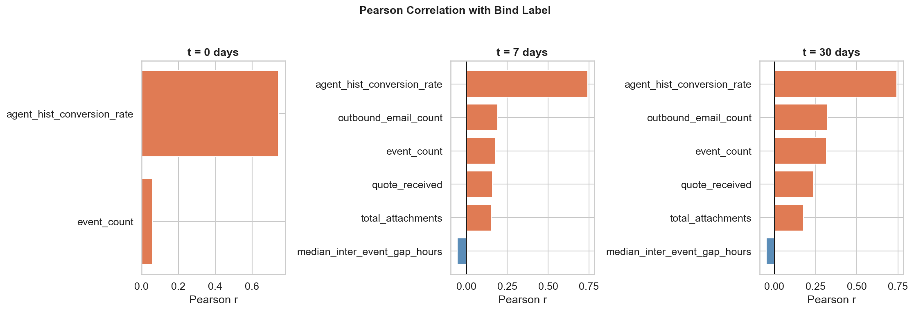
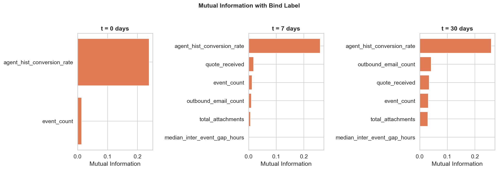
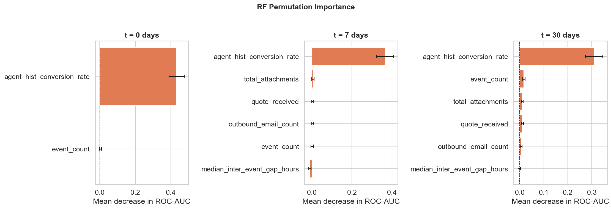
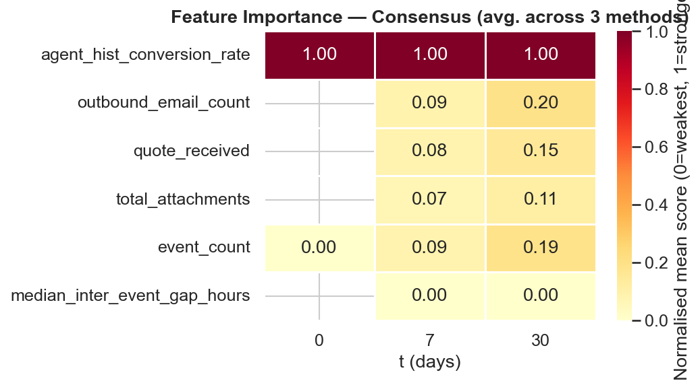

# Task 2: Predictive Significance

Full notebook: [predictive_significance.ipynb](predictive_significance.ipynb)

## Features

Six features are proposed, each implemented as `feature(submission_id, t)` in [src/features.py](src/features.py).

| Feature | Description | Signal direction | Available at t=0 |
|---|---|---|---|
| `agent_hist_conversion_rate` | Agent's historical conversion rate — must be computed from the training fold only (see leakage note) | Higher → more likely to bind | Yes |
| `event_count` | Total events of any type up to day t | Higher → more likely | Yes |
| `quote_received` | Count of `QUOTE_RECEIVED` events up to day t | Higher → more likely | No |
| `inbound_email_count` | Number of inbound emails received up to day t | Higher → more likely | No |
| `outbound_email_count` | Number of outbound emails sent up to day t | Higher → more likely | No |
| `total_attachments` | Total email attachments (inbound + outbound) up to day t | Higher → more likely | No |
| `median_inter_event_gap_hours` | Median hours between consecutive events up to day t | Lower → more likely (faster cadence = active deal) | No |
| `days_since_last_event` | Days between the most recent event and cutoff t; equals t if no events | Lower → more likely (recency of activity) | No |

> **Leakage note:** `agent_hist_conversion_rate` must be computed from the training fold only. Computing it on the full dataset before the train/test split leaks label information into the test set.

---

## Analysis

Three complementary methods were applied at each valid `t ∈ {0, 7, 30}`:

1. **Pearson r** — linear correlation with the binary label
2. **Mutual Information** — non-linear, model-free association
3. **Random Forest Permutation Importance** — model-based (300 trees, `class_weight='balanced'`), scored by mean ROC-AUC drop over 30 shuffle repeats on a stratified 70/30 test split

Each method's scores were min-max normalised to [0, 1] within each `t` and averaged into a consensus score.

### Pearson Correlation

### Mutual Information

### RF Permutation Importance

### Consensus Ranking

---

## Conclusions

**Feature ranking (strongest → weakest):**

1. `agent_hist_conversion_rate` — unanimous #1 across all methods and all t values. Raw Pearson r ≈ 0.7, far above everything else. The only meaningful signal at t=0.
2. `outbound_email_count` — consistently the second-strongest activity feature. Grows from t=7 to t=30.
3. `quote_received` — strong milestone signal; always 0 at t=0 so only useful from t=7.
4. `event_count` — broadly correlated with the above; adds some independent signal at t=30.
5. `total_attachments` — modest signal, partially redundant with outbound email count.
6. `median_inter_event_gap_hours` — scores ~0 across all methods. Appears weak in a multivariate setting despite a visual signal in EDA. **Candidate for removal.**

**Key observations:**

- The consensus scores outside `agent_hist_conversion_rate` look small because the normalisation is anchored to it. The raw correlations for activity features (r ≈ 0.15–0.30) are meaningful for a noisy, imbalanced real-world problem — not junk.
- Features 2–5 are correlated with each other (all measure variations of "activity volume"). Individually modest; collectively they may contribute more in a model.
- `median_inter_event_gap_hours` is the one feature that does not survive multivariate scrutiny and is a candidate to drop before modelling.
- At t=0, only `agent_hist_conversion_rate` carries signal. The model at t=0 will be a near-single-feature model.
