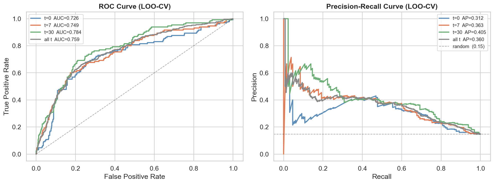
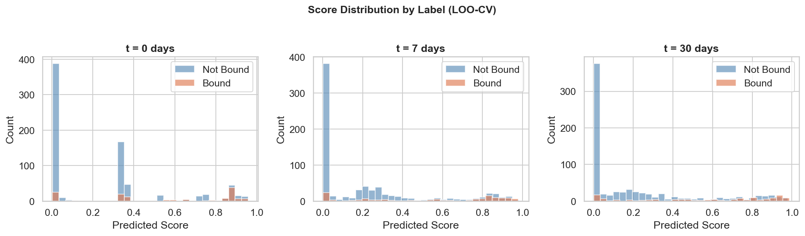
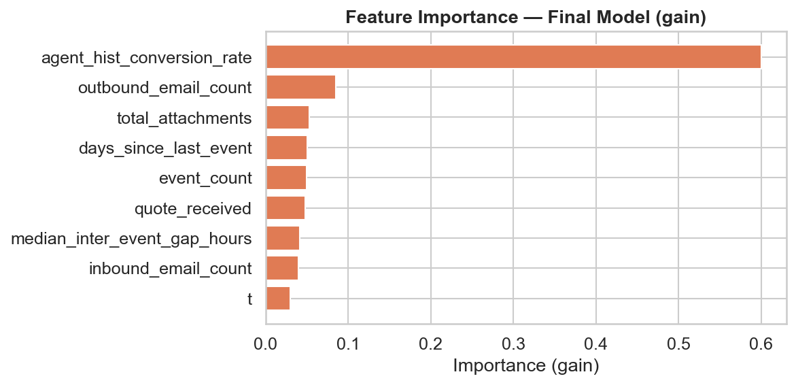

# Task 3: Bind Score Model

Training script: [src/train.py](src/train.py)

---

## Design Decisions

### Single Model vs. One Model per t

`bind_score(submission_id, t)` takes `t` as an input, implying a single callable interface. Two approaches were considered:

- **Single model with `t` as a feature** — one model handles all time windows; `t` is passed as an input alongside the activity features.
- **One model per t, dispatched at call time** — three independent models routed by an `if/else` on `t`.

We chose the **single model** approach. The three-model dispatcher is technically cleaner (the prediction problem genuinely differs at t=0 vs. t=30) but is likely over-engineering too. Including `t` as a feature lets a tree-based model learn t-conditional split thresholds implicitly — e.g. "if t=7 AND outbound_email_count > 3" — without hand-crafting the interactions. This was a more efficient option.

### Handling Class Imbalance

The dataset is heavily imbalanced (~13% positive, ratio ≈ 6.5:1). Options considered:

- **Sampling strategies** (SMOTE, undersampling) — not applied; the dataset is not large enough to absorb the information loss from undersampling, and SMOTE on this feature set adds complexity without clear benefit at this scale.
- **`scale_pos_weight`** (XGBoost native) — applied. Set to `(# negatives) / (# positives)` per fold, upweighting bound submissions during training. Equivalent to `class_weight='balanced'` in sklearn, but computed fresh each LOO fold to avoid leakage.

### Model Choice

| Model | Considered | Decision |
|---|---|---|
| Logistic Regression | Yes | Requires manual interaction terms for `t`-dependent features; linear assumption too restrictive |
| Random Forest | Yes | Handles interactions well; used in significance analysis but doesn't naturally handle `t` as a context variable as cleanly as boosting |
| **XGBoost (GBT)** | **Yes** | **Chosen.** Handles t-dependent feature interactions implicitly via tree splits, native NaN support (no imputation needed for sparse t=0 features), `scale_pos_weight` for imbalance, and well-understood behaviour on small tabular datasets |

### Tree Depth

Shallow trees were preferred to avoid overfitting on 880 training samples. Results across depths:

| `max_depth` | ROC-AUC (all t) | PR-AUC (all t) |
|---|---|---|
| 4 | 0.748 | 0.340 |
| 3 | 0.755 | 0.345 |
| **2** | **0.759** | **0.360** |
| 1 (stumps) | 0.754 | 0.370 |

Depth=2 was selected — best overall performance. It allows pairwise interactions (e.g. agent rate × activity level) without the overfitting risk of deeper trees.

### Evaluation: LOO-CV

| CV method | Considered | Decision |
|---|---|---|
| Stratified k-fold (k=5) | Yes | ~23 positives per test fold — too few for stable metrics |
| Repeated k-fold | Yes | Improves stability but doesn't solve the thin positive class problem |
| **LOO-CV on submission_id** | **Yes** | **Chosen.** Every positive is evaluated exactly once; training set per fold is ~880 submissions × 3 snapshots. Evaluation unit is submission (not row) to prevent the t=0/t=7/t=30 snapshots of the same submission from leaking across folds |

**Important:** `agent_hist_conversion_rate` is recomputed from training submissions only inside each LOO fold to prevent label leakage through the agent feature.

### Agent Rate Smoothing

Raw agent conversion rates are noisy for low-volume agents (1–2 submissions yields 0% or 100%, which is noise not skill). Bayesian shrinkage toward the global mean was applied:

```
smoothed_rate = (positives + α × global_mean) / (n + α)
```

`α = 10` — agents with fewer than ~10 submissions are pulled substantially toward the global mean; high-volume agents are largely unaffected. This improved PR-AUC consistently across all t values.

---

## Final Model Configuration

```python
XGBClassifier(
    n_estimators=200,
    learning_rate=0.05,
    max_depth=2,
    subsample=0.8,
    colsample_bytree=0.8,
    scale_pos_weight=~6.5,   # recomputed per fold
    tree_method="hist",
)
```

Agent rate smoothing: `α = 10`

Model serialised to [output/model/bind_score.json](output/model/bind_score.json).

---

## Results

**Metrics:** ROC-AUC measures overall ranking quality regardless of threshold — appropriate here because `bind_score` is used as a ranking tool, not a binary classifier. PR-AUC (average precision) complements it by focusing specifically on the minority class: it measures how well the model ranks bound submissions near the top of the list, which is exactly what a broker prioritization tool needs. With only ~13% positives, accuracy or F1 at a fixed threshold would be misleading — a model that predicts "not bound" for everything achieves 87% accuracy while being useless.

Evaluated via LOO-CV on 881 submissions. Baseline PR-AUC (random classifier) = **0.15**.

| t | ROC-AUC | PR-AUC | PR-AUC lift vs. random |
|---|---|---|---|
| 0 | 0.726 | 0.312 | 2.1× |
| 7 | 0.749 | 0.363 | 2.4× |
| 30 | 0.784 | 0.406 | 2.7× |
| all t | 0.759 | 0.360 | 2.4× |

As expected, later time windows are easier to predict (more accumulated signal). The t=0 model relies almost entirely on `agent_hist_conversion_rate` and still achieves a meaningful lift, validating the value of early prediction.

### ROC & Precision-Recall Curves



### Score Distributions by Label



### Feature Importance (Final Model)



`agent_hist_conversion_rate` dominates as expected. `quote_received`, `t` itself, and `outbound_email_count` are the next tier. All features contribute positively — none were dropped.
